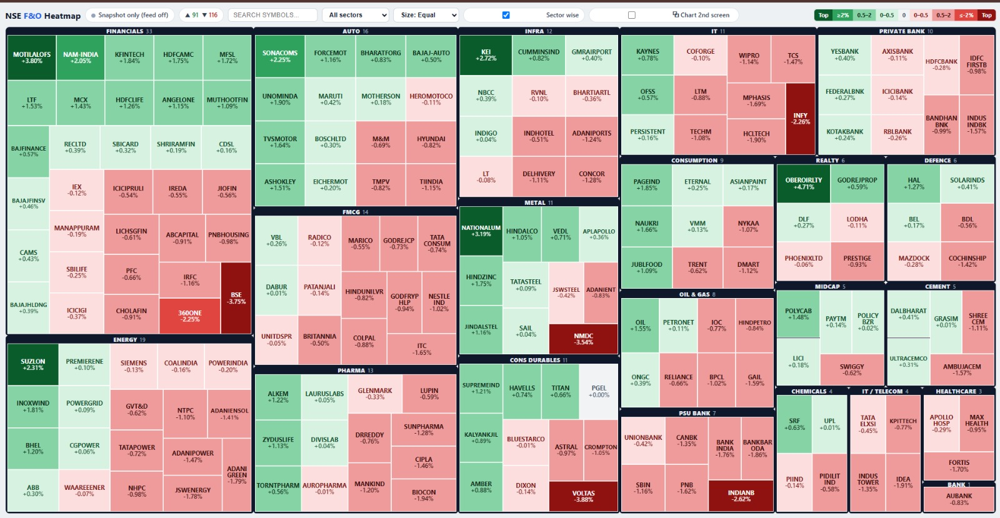
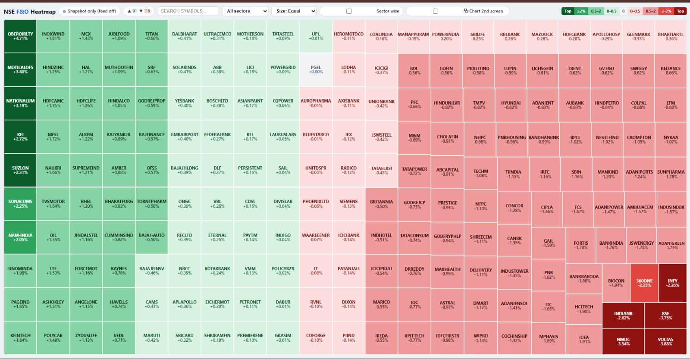
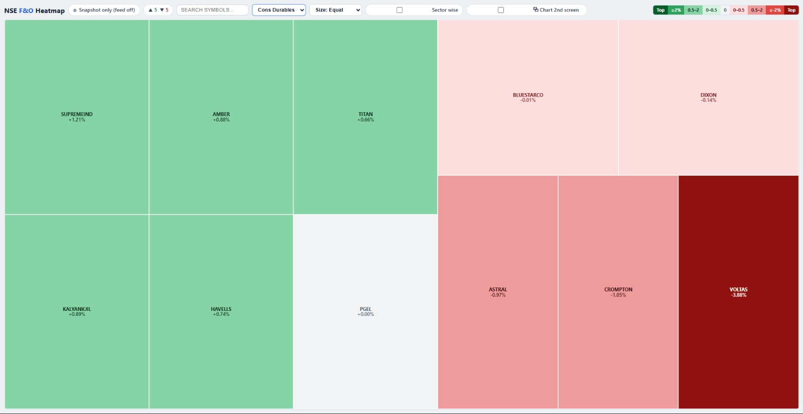

# NSE F&O Live Heatmap

**Every F&O stock on one screen, repainting live from the market feed.**

A treemap of the whole NSE derivatives universe — around 200 stocks — coloured by the day's move and sized by whatever you care about. It resolves the universe from the exchange's own instrument master, verifies the previous close before painting a single tile, and then streams ticks over a WebSocket so the map is live rather than polled.



<p align="left">
  
  
  
  
</p>

> [!NOTE]
> This is a **market visualisation tool**, not a trading system. It shows prices. It has no strategy, no signals, no indicators and no order placement — by design.

---

## What it does well

**The previous close is treated as the hard part, because it is.** Every colour on the page is `(LTP − prev_close) / prev_close`, so one wrong denominator silently repaints the entire map. Two things go wrong in practice and both are handled:

- The broker's `net_change` field is zero for every stock, and its `ohlc.close` flips to *today's* close after the session ends — so reading it at the wrong moment gives you a map of zeroes. [`prevclose.py`](prevclose.py) works out whether that field currently means "previous session" before trusting it, and verifies the cheap bulk source against a per-stock sample.
- On a Saturday, "today" is Friday. Taking `date.today()` there yields Friday's close minus Friday's price — a perfectly plausible, completely flat heatmap. [`nse_holidays.py`](nse_holidays.py) resolves the *session* day instead, and weekends and NSE holidays both fall out of it.

**The universe is never hardcoded.** It is the distinct set of underlyings across NSE `FUTSTK` rows in the daily instrument master, joined back to each name's equity security ID. SEBI revises the F&O list monthly; the map follows automatically, and prints what joined or left since the last run. If the download fails or comes back truncated, it is rejected rather than used — a half-downloaded CSV is worse than yesterday's.

**Colour is banded, but the extremes are ranked.** Fixed thresholds fail in both directions: on a strong day everything saturates, on a quiet day nothing does. So the bands are fixed and the *darkest* shade goes to the top N movers at each end — with a floor, so a flat day cannot crown a +0.3% stock.

**The socket thread does almost nothing.** Ticks only write numbers into memory and mark a stock dirty. Building rows, encoding JSON and fanning out to browsers all happen on a separate publisher timer, so a slow client can never back up the feed.

---

## The map

| | |
| :--- | :--- |
| **Size by** | equal · turnover · absolute move |
| **Group by** | flat treemap, or one labelled block per sector |
| **Filter** | search by symbol, or narrow to a single sector |
| **Click a tile** | opens that stock's 5-minute TradingView chart |
| **Second screen** | charts can open on your other monitor, in one Chrome window, each in a new tab |
| **Phone / other PC** | serves on the LAN automatically; optional ngrok tunnel for other networks |

Tiles carry the symbol and change%, auto-fitted: the renderer sizes the text for one line and for two, then keeps whichever is bigger, so short names stay large and long ones stay readable instead of clipping.

**Flat — the whole universe at once**



**Filtered to one sector**



---

## How a run goes

```
  1. UNIVERSE    instrument master (once a day, validated) → F&O list,
                 plus what changed since the last run
  2. DATABASE    optional — refresh the 5-min candle DB if you use it as
                 the previous-close source
  3. TOKEN       borrowed or freshly minted, then a Data-API preflight
  4. PREV CLOSE  resolved AND verified — the denominator of every colour
  5. SERVE       the page comes up already painted
  6. WAIT        started before 09:15? everything above needs no live data,
                 so it sits until the bell with the map ready
  7. LIVE        socket → ticks → page, every second
```

The order matters. The preflight in step 3 exists because a Dhan account **without the Data API add-on does not fail the handshake** — it accepts the socket, takes the subscribe, and closes silently. From the client that is indistinguishable from a network blip, so it reconnects forever. One explicit check up front turns a whole wasted session into an error message.

```bash
python main.py                 # everything
python main.py --no-browser
python main.py --no-update     # skip the 5-min DB refresh
python main.py --no-tunnel     # no public link
python main.py --snapshot      # one REST snapshot, served, no socket
python main.py --fresh         # ignore today's prev-close cache
python main.py --port 7001
```

`--snapshot` is the useful one on a weekend: a fully painted map of the last session, with no socket at all.

---

## Setup

Requires a [Dhan](https://dhanhq.co) account with API access — this reads live data, so there is no offline mode.

```bash
git clone https://github.com/tejgohel/nse-live-heatmap.git
cd nse-live-heatmap

python -m venv .venv
# Windows:  .venv\Scripts\activate
# macOS/Linux:
source .venv/bin/activate

pip install -r requirements.txt
cp .env.example .env        # Windows: copy .env.example .env
```

Fill in `.env`:

```ini
DHAN_CLIENT_ID=your_client_id
DHAN_ACCESS_TOKEN=your_access_token

# Optional but recommended — mints a fresh token on every run
DHAN_PIN=your_login_pin
DHAN_TOTP_SECRET=your_base32_2fa_seed
```

Check the account before market open — this one command is the difference between a working feed and a reconnect loop:

```bash
python dhan_feed.py     # must print OK
python main.py
```

The map opens at **http://localhost:7000/**, and the LAN address for your phone is printed alongside it.

### About login

Tokens last about a day, and **the broker invalidates the previous one the moment a new one is issued** — so two programs logging in on the same account keep killing each other's feed. Give this one its own account if you run anything else.

Token generation is also throttled to roughly one per two minutes, and when it refuses it *drops the TLS connection* rather than answering, so the failure arrives looking exactly like a network fault. [`auto_login.py`](auto_login.py) recognises that message and the TOTP-rollover one, and backs off past the window instead of hammering it.

---

## Previous close: two sources

| `PREVCLOSE_SOURCE` | What it uses | Needs |
| :--- | :--- | :--- |
| `"quote"` *(default)* | the broker's official 15:30 close — what every other site shows | nothing but the API |
| `"db"` | the last 5-min bar (15:10) of that session | a local `candles_5min.db` |

The intraday feed stops at 15:10, so `"db"` misses the session's last ~20 minutes and its percentages differ slightly from a broker's "day change" — but they match the final candle on a 5-minute chart exactly. Point `FIVEMIN_DB` at your own file, and optionally `FIVEMIN_UPDATER` at a script that refreshes it before the map is built. Leave both unset and `"quote"` handles everything.

---

## Configuration

All of it is in [`config.py`](config.py), documented inline.

| Setting | Default | Meaning |
| :--- | :--- | :--- |
| `PORT` | `7000` | dashboard port |
| `PUSH_INTERVAL_SEC` | `30` | how often changed rows reach the browser (purely cosmetic) |
| `BAND_STRONG` / `BAND_MILD` / `BAND_FLAT` | `2.0` / `0.50` / `0.01` | change% cut-offs for each colour band |
| `TOP_N` / `MIN_EXTREME_PCT` | `5` / `2.0` | how many names wear the darkest shade, and the floor for it |
| `PREVCLOSE_SOURCE` | `"quote"` | see above |
| `CHART_MONITOR` | `-1` | `-1` = whichever monitor is not primary |
| `CHART_PROFILE` | `"same"` | `"same"` keeps your TradingView login; `"separate"` uses a blank profile |
| `NGROK_ENABLED` | `False` | public tunnel — the URL is **public**, do not share it |
| `SCAN_END` | `15:40` | when the feed stops |

---

## Project layout

```
nse-live-heatmap/
├── main.py               orchestration — the seven steps above
├── universe.py           F&O universe from the instrument master
├── sectors.py            symbol → sector label
├── prevclose.py          resolves AND verifies the previous close
├── nse_holidays.py       trading calendar + "which session is on screen"
├── dhan_feed.py          account selection, token lifecycle, Data-API preflight
├── auto_login.py         TOTP token generation, expiry and liveness checks
├── heatmap_ws.py         the market-feed socket → in-memory rows
├── frontend_heatmap.py   Flask + SSE dashboard (treemap, single file)
├── chartwin.py           opens a chart on a chosen monitor
├── chart_agent.py        tiny helper so a remote viewer gets charts locally
├── db_update.py          optional 5-min database freshness check
├── tunnel.py             optional ngrok tunnel
└── tests/                previous-close rule, CSS structure, profile parsing
```

---

## Security

- **No credential is in source.** `config.py` reads everything from environment variables or a local `.env`, and documents what to set and where to find it.
- `.env`, `access_token.txt`, the instrument master and every `*.db` are git-ignored.
- **Read-only against the broker** — it reads quotes, daily history and the market feed. There is no order placement, position management or fund-transfer code anywhere in this repository.
- If you enable the tunnel, remember the URL is public. Only prices, sector and day OHLC ever reach the page — no token, no credentials — but anyone with the link can watch your screen.

---

## Disclaimer

For research and education. This tool visualises market data and nothing else — it produces no recommendations and places no orders. Prices may be delayed, incomplete or wrong; verify anything that matters against your broker before acting on it. Trading carries substantial risk of loss.

---

## License

[MIT](LICENSE)
